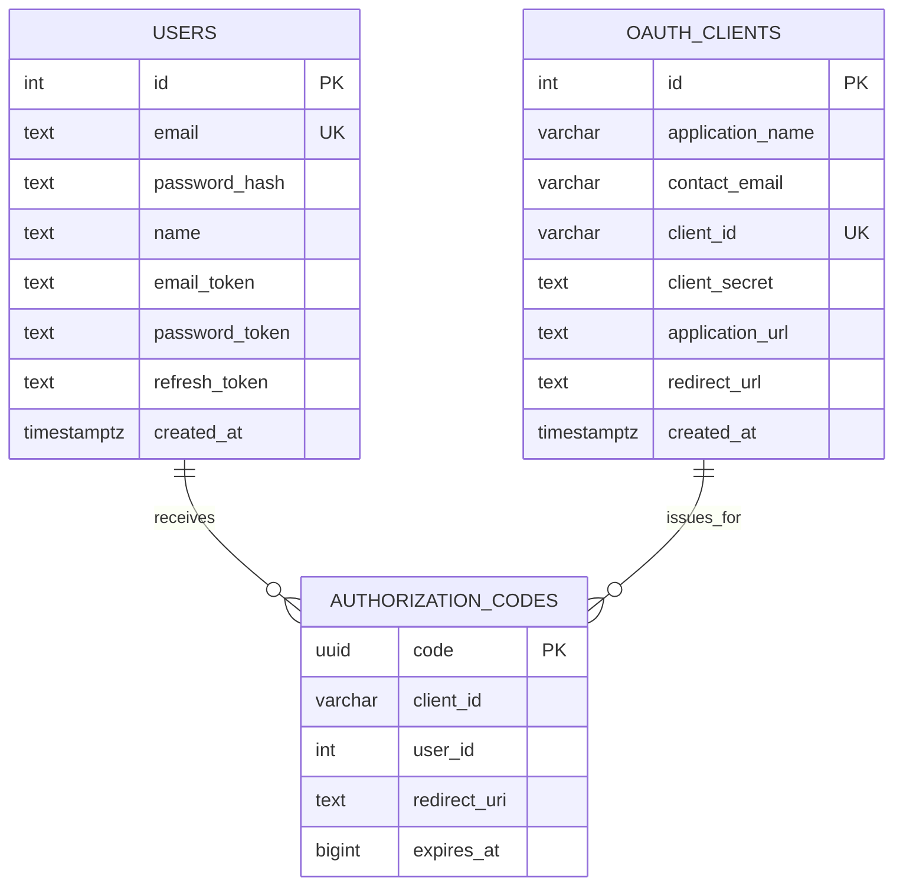

# OIDC / OAuth Authentication Service

This project is a TypeScript + Express authentication service that implements a lightweight OAuth 2.0 / OpenID Connect style flow.

It supports:

- OAuth client registration
- User signup and signin
- Authorization code generation
- Token exchange
- Protected `userinfo`
- JWKS exposure
- OpenID configuration discovery

## Architecture Overview

The application is organized into three main layers:

- `controller` layer: handles HTTP requests and responses
- `service` layer: contains auth and OAuth business logic
- `db` layer: defines the PostgreSQL schema and Drizzle connection

The UI pages for signup, signin, and client registration are served from the `public/` folder as static HTML pages.

## Project Structure

```text
OIDC-OAuth/
|-- cert/
|   |-- private.pem
|   `-- public.pem
|-- dist/
|   `-- ...compiled JavaScript output
|-- drizzle/
|   |-- 0000_clear_risque.sql
|   `-- meta/
|       |-- 0000_snapshot.json
|       `-- _journal.json
|-- public/
|   |-- client-register.html
|   |-- signin.html
|   `-- signup.html
|-- src/
|   |-- index.ts
|   |-- app/
|   |   |-- app.ts
|   |   |-- common/
|   |   |   `-- utils/
|   |   |       |-- ApiError.ts
|   |   |       |-- ApiResponse.ts
|   |   |       `-- jwt.utils.ts
|   |   `-- module/
|   |       `-- auth/
|   |           |-- controller.ts
|   |           |-- middleware.ts
|   |           |-- routes.ts
|   |           |-- services.ts
|   |           `-- validate.ts
|   `-- db/
|       |-- config.ts
|       `-- schema.ts
|-- .env
|-- drizzle.config.js
|-- package.json
|-- tsconfig.json
`-- README.md
```

## Folder And File Responsibilities

### `src/index.ts`

Application entry point. It loads environment variables, creates the HTTP server, and starts listening on the configured `PORT`.

### `src/app/app.ts`

Builds the Express application and wires together:

- JSON and URL-encoded body parsing
- static file serving from `public/`
- OIDC discovery endpoint
- auth routes
- centralized error handling

### `src/app/module/auth/controller.ts`

HTTP-facing logic for the authentication module. This file:

- serves the HTML pages
- normalizes request payloads
- validates incoming data using Zod schemas
- delegates real business logic to services
- returns consistent API responses

### `src/app/module/auth/services.ts`

Contains the main business logic for:

- registering OAuth clients
- creating users
- authenticating users
- issuing authorization codes
- exchanging codes for tokens
- returning sanitized user profile data

Important implementation detail:

- authorization codes are currently stored in an in-memory `Map`
- they are not persisted in PostgreSQL
- they expire after 5 minutes
- they are removed after token exchange

### `src/app/module/auth/routes.ts`

Defines the auth router endpoints. Since this router is mounted with `app.use("/api/auth", authRouter)`, the effective URL is the mount path plus the route path declared inside the router.

Example:

- `router.get("/signin")` becomes `GET /api/auth/signin`

### `src/app/module/auth/middleware.ts`

Protects secured endpoints by validating Bearer access tokens and attaching the decoded user payload to the request.

### `src/app/module/auth/validate.ts`

Contains Zod validation schemas for:

- user signup
- user login
- OAuth client registration
- authorization code token exchange

### `src/db/schema.ts`

Defines the PostgreSQL schema using Drizzle ORM.

### `src/db/config.ts`

Creates the Drizzle database client using `process.env.DATABASE_URL`.

### `src/app/common/utils/`

Shared utilities:

- `ApiError.ts`: structured application error class
- `ApiResponse.ts`: consistent API success response wrapper
- `jwt.utils.ts`: token generation helpers

### `public/`

Contains the frontend HTML pages used by the auth flow:

- `client-register.html`
- `signup.html`
- `signin.html`

### `cert/`

Stores the RSA key pair used for signing and exposing verifiable JWT metadata:

- `private.pem`: used for signing tokens
- `public.pem`: used for JWKS / token verification

## Request Flow

### 1. OAuth Client Registration

1. A client opens the registration page.
2. The registration form submits application metadata.
3. The service generates:
   - `clientId`
   - `clientSecret`
4. The client record is stored in PostgreSQL.

### 2. User Signup Or Signin

1. A user opens `/signup` or `/signin`.
2. OAuth context such as `client_id`, `redirect_uri`, and `state` is normalized.
3. If `client_id` is present, the service validates the registered client.
4. On success:
   - signup creates a new user
   - signin verifies the existing user

### 3. Authorization Code Creation

After successful signup or signin:

- a short-lived authorization code is generated
- the code is stored in memory
- a redirect URL is built with:
  - `code`
  - optional `state`

### 4. Token Exchange

1. The client submits:
   - authorization `code`
   - `clientId`
   - `clientSecret`
   - optional `redirectUri`
2. The service validates the client credentials.
3. The code is verified and deleted after use.
4. JWTs are generated and returned with user data.

### 5. Protected User Info

1. The client calls `/userinfo` with a Bearer access token.
2. Middleware validates the token.
3. The user record is loaded from the database.
4. Sensitive fields are removed before returning the payload.

## Data Model

The persisted database currently contains two tables:

- `users`
- `oauth_clients`

The service also uses one non-persistent runtime store:

- `authorizationCodes` in memory

## ER Diagram



## Entity Notes

### `users`

Stores registered end users.

Key fields:

- `email` is unique
- `password_hash` stores the bcrypt hash
- `refresh_token` exists in schema for token-related storage
- `created_at` tracks user creation time

### `oauth_clients`

Stores third-party or internal apps that are allowed to use the OAuth flow.

Key fields:

- `client_id` is unique
- `client_secret` is used during token exchange
- `redirect_url` is validated during authorization and token exchange

### `authorizationCodes`

This is not a database table yet. It is currently an in-memory `Map` in `src/app/module/auth/services.ts`.

Stored runtime fields:

- `clientId`
- `userId`
- `redirectUri`
- `expiresAt`

Limitation:

- codes are lost if the server restarts

## Current Endpoints

Based on the current route definitions and app mounting:

- `GET /`
- `GET /.well-known/openid-configuration`
- `GET /api/auth/auth/client/register`
- `POST /api/auth/auth/client/register`
- `GET /api/auth/signup`
- `POST /api/auth/signup`
- `GET /api/auth/signin`
- `POST /api/auth/signin`
- `POST /api/auth/token`
- `GET /api/auth/userinfo`
- `GET /api/auth/certs`

Note:

- the client registration route currently includes `/auth` twice because the router is mounted at `/api/auth` and the route is declared as `/auth/client/register`

## Tech Stack

- Node.js
- TypeScript
- Express
- Drizzle ORM
- PostgreSQL
- Zod
- bcryptjs
- jsonwebtoken

## Available Scripts

```bash
npm run dev
npm run build
npm start
npm run studio
npm run db:generate
npm run db:migrate
```

## Environment Variables

Expected environment variables include:

```env
PORT=
DATABASE_URL=
JWT_SECRET=
JWT_EXPIRES_IN=
REFRESH_TOKEN_SECRET=
REFRESH_TOKEN_EXPIRES_IN=
```

If your `.env` contains additional variables, they can be documented here as the project grows.


